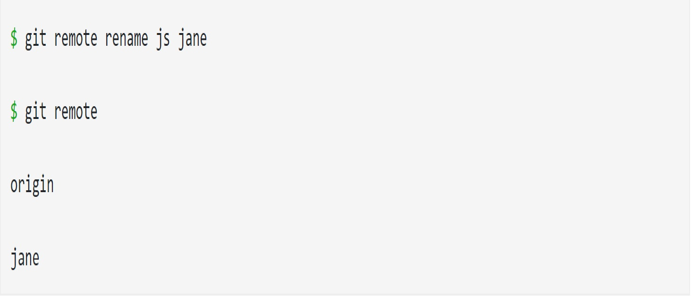

# readlab02

# `Seeing Your Remotes`

By running the git remote command, you can view the short names, such as `“origin,”` of all specified remote handles.
By using git remote -v, you can view all the remote *URLs next to their corresponding short names*

#Fetching

Fetching entails pulling data that you don't have from a remote project. Here is the command format: 🌲

> git fetch [remote-name]

💢 **Note:** git fetch solely pulls new data to a local repository; it does not merge changes with or modify your local work. We will discuss merging in a later section. Later, we will also discuss git pull , which allows for fetching and automatic merging.

# Renaming/Removing Remotes

**Rename

To rename a remote’s short name, `use the git remote rename command.`

Example:

