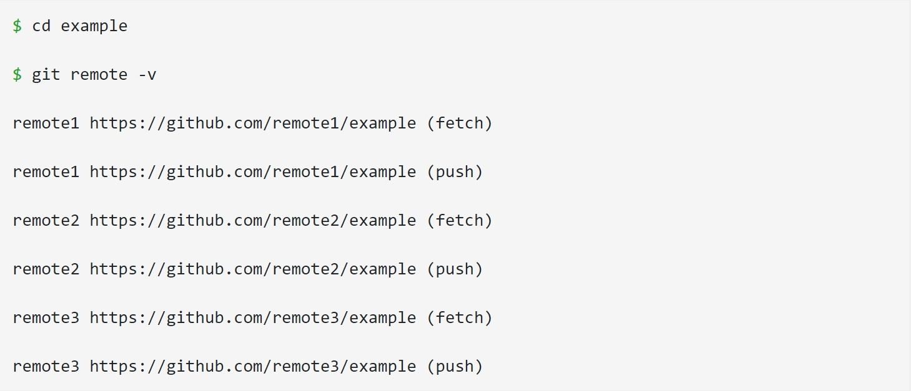

# readlab02

# INTRODUCTION

## Prerequisites

Before beginning this tutorial, it is highly recommended that you have a solid understanding of the Terminal *(for Mac)* or Command Line *(for Windows and Linux)*.

## Version Control

Version Control is a system that allows you to revisit various versions of a file or set of files by recording changes. Through version control, one can revert a file or project to a previous version, track modifications and modifying individuals, and compare changes. By utilizing a Version Control System (VCS), mistakes with files can easily be rectified

### Local Version Control

** Many years ago, programmers created Local Version Control systems. A Local VCS entails one database on your hard disk that stores changes to files.**

#### So, what is Git?

1. Snapshots
2. Local Operations
3. Tracking Changes
4. Loss of Data
5. States   
[more](https://blog.udemy.com/git-tutorial-a-comprehensive-guide/#1)

## Staged

*Flagged a file’s changed version to be committed in the next snapshot*

## *History of Git*

`Git traces its roots to the open source software project Linux kernel. Developers of this project began using a DVCS called BitKeeper in 2002. In 2005, many of these developers stopped using this DVCS due to tension between the Linux kernel community and the company behind BitKeeper’s and the eventual revocation of the DVCS’ gratis status. Subsequently, Linus Torvalds, the chief architect of the Linux kernel, began creating Git. With the intention of creating a DVCS with a workflow design similar to that of BitKeeper, which was also fast, Git allowed for non-linear development via multiple branches, could support large projects, possessed strong mechanisms preventing corruption, and had a simple design. Since its inception in 2005, Git has become one of the most utilized Version Control Systems in the world.`

# `Seeing Your Remotes`

By running the git remote command, you can view the short names, such as `“origin,”` of all specified remote handles.
By using git remote -v, you can view all the remote *URLs next to their corresponding short names*

#Fetching

Fetching entails pulling data that you don't have from a remote project. Here is the command format: 🌲

> git fetch [remote-name]

💢 **Note:** git fetch solely pulls new data to a local repository; it does not merge changes with or modify your local work. We will discuss merging in a later section. Later, we will also discuss git pull , which allows for fetching and automatic merging.

# Renaming/Removing Remotes

**Rename :left_speech_bubble:	

To rename a remote’s short name, `use the git remote rename command.`

Example:

# Commit Mistakes 💥

`You can use the –amend command when you need to alter a commit message or forgot to add some files.`

`**$ git commit --amend**`

*In the example above, you can use this command to easily change your commit message, if no changes were made since the newest commit*

`$ git commit -m “my first commit”`

`$ git add example_file`

`$ git commit --amend`

